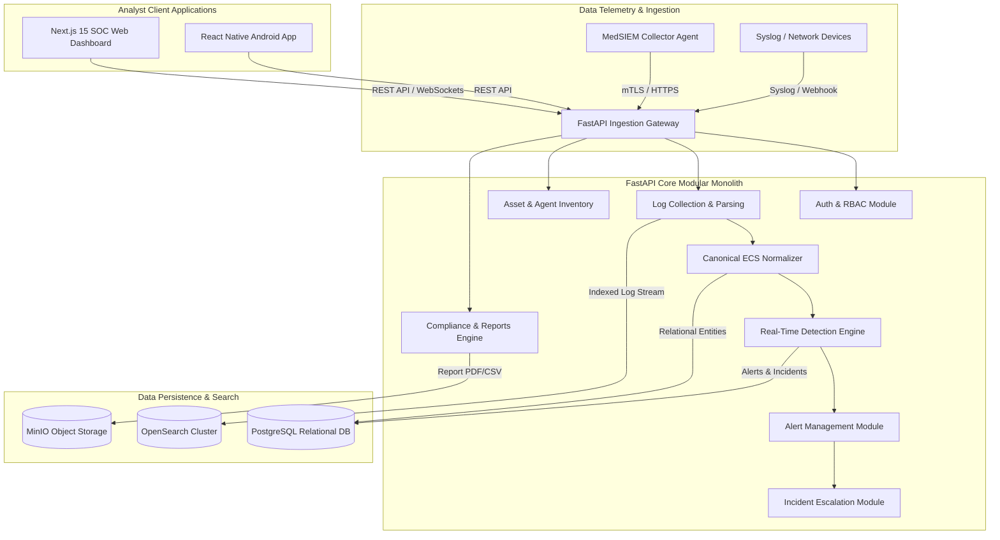
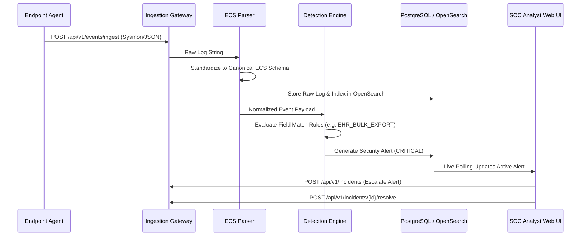

# MedSIEM System Architecture & Diagrams

## 1. High-Level Modular Monolith System Architecture

```mermaid
flowchart TB
    subgraph Data Telemetry & Ingestion
        AG[MedSIEM Collector Agent] -->|mTLS / HTTPS| GW[FastAPI Ingestion Gateway]
        SYS[Syslog / Network Devices] -->|Syslog / Webhook| GW
    end

    subgraph FastAPI Core Modular Monolith
        GW --> Auth[Auth & RBAC Module]
        GW --> LogMod[Log Collection & Parsing]
        LogMod --> Norm[Canonical ECS Normalizer]
        Norm --> Det[Real-Time Detection Engine]
        Det --> AlertMod[Alert Management Module]
        AlertMod --> IncMod[Incident Escalation Module]
        
        GW --> AssetMod[Asset & Agent Inventory]
        GW --> RepMod[Compliance & Reports Engine]
    end

    subgraph Data Persistence & Search
        LogMod -->|Indexed Log Stream| OS[(OpenSearch Cluster)]
        Norm -->|Relational Entities| PG[(PostgreSQL Relational DB)]
        Det -->|Alerts & Incidents| PG
        RepMod -->|Report PDF/CSV| MinIO[(MinIO Object Storage)]
    end

    subgraph Analyst Client Applications
        WebUI[Next.js 15 SOC Web Dashboard] -->|REST API / WebSockets| GW
        MobileApp[React Native Android App] -->|REST API| GW
    end
```

## 2. Event -> Detection -> Alert -> Incident Pipeline

```mermaid
sequenceDiagram
    participant Endpoint as Endpoint Agent
    participant Ingestion as Ingestion Gateway
    participant Parser as ECS Parser
    participant Engine as Detection Engine
    participant DB as PostgreSQL / OpenSearch
    participant SOC as SOC Analyst Web UI

    Endpoint->>Ingestion: POST /api/v1/events/ingest (Sysmon/JSON)
    Ingestion->>Parser: Raw Log String
    Parser->>Parser: Standardize to Canonical ECS Schema
    Parser->>DB: Store Raw Log & Index in OpenSearch
    Parser->>Engine: Normalized Event Payload
    Engine->>Engine: Evaluate Field Match Rules (e.g. EHR_BULK_EXPORT)
    Engine->>DB: Generate Security Alert (CRITICAL)
    DB->>SOC: Live Polling Updates Active Alert
    SOC->>Ingestion: POST /api/v1/incidents (Escalate Alert)
    SOC->>Ingestion: POST /api/v1/incidents/{id}/resolve
```
